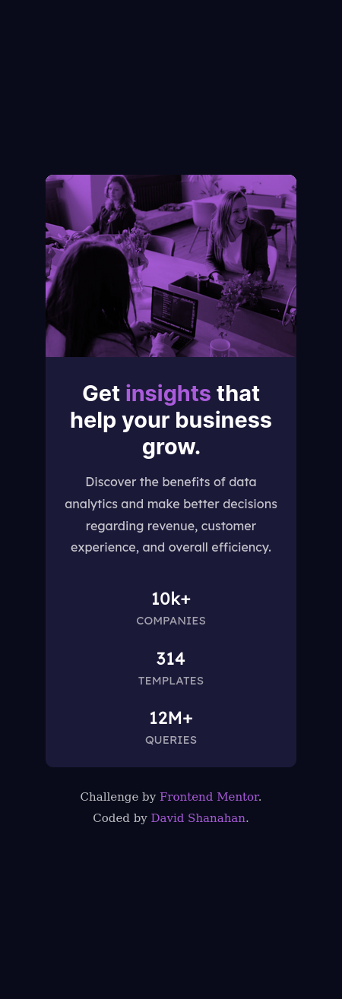

# Frontend Mentor - Stats preview card component solution

This is a solution to the [Stats preview card component challenge on Frontend Mentor](https://www.frontendmentor.io/challenges/stats-preview-card-component-8JqbgoU62). Frontend Mentor challenges help you improve your coding skills by building realistic projects. 

## Table of contents

- [Overview](#overview)
  - [The challenge](#the-challenge)
  - [Screenshot](#screenshot)
  - [Links](#links)
- [My process](#my-process)
  - [Built with](#built-with)
  - [What I learned](#what-i-learned)
- [Author](#author)

**Note: Delete this note and update the table of contents based on what sections you keep.**

## Overview

### The challenge

Users should be able to:

- View the optimal layout depending on their device's screen size

### Screenshot

#### Mobile Solution



#### Desktop Solution


### Links

- Solution URL: [Add solution URL here](https://your-solution-url.com)
- Live Site URL: [Add live site URL here](https://your-live-site-url.com)

## My process

### Built with

- Semantic HTML5 markup
- CSS custom properties
- Flexbox
- Mobile-first workflow

### What I learned

How to create a simple overlay background over an image.

```html
  <section class="card-image-container">
    
  </section>
```
```css
.card-image-container {
    /* height: 100%; */
    width: 100%;
    background-color: var(--accent);
    border-radius: 10px 10px 0 0;
}

#card-image {
    height: 100%;
    width: 100%;
    opacity: 0.5;
    border-radius: 10px 10px 0 0;

}
```

## Author

- Website - David Shanahan (https://vulnerable.computer)
- Frontend Mentor - [@ds0-sec](https://www.frontendmentor.io/profile/ds0-sec)
- Twitter - [@0ds01](https://twitter.com/0ds01)
